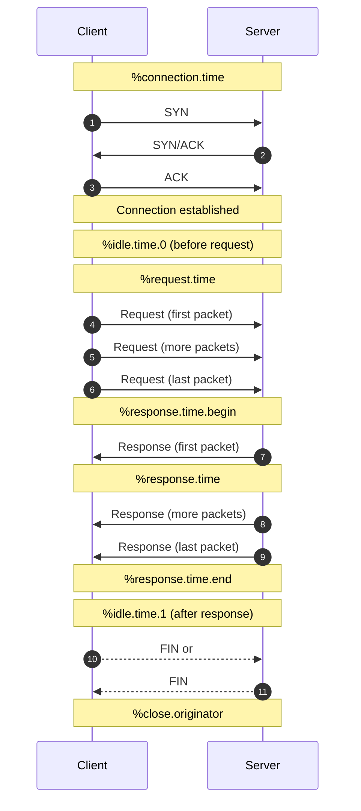

Perfect — I’ll update the README so it correctly states **GPLv3** and reorganize it into a clean, modern, GitHub‑optimized structure with badges.

Below is the **fully updated README**, polished and ready to drop into your repository.

---

# Justniffer  
[Project Page](https://onotelli.github.io/justniffer/)

<p align="left">
  
  
  
  
</p>

---

## Overview

**Justniffer** is a network TCP packet sniffer and logging tool designed to capture, decode, and analyze TCP/IP traffic with a strong focus on HTTP. Its flexible logging engine allows it to adapt to virtually any TCP‑based protocol, making it useful for debugging, performance analysis, and custom traffic inspection.

Justniffer can decode HTTP requests and responses, extracting:

- Client and server IP addresses  
- Requested URLs  
- HTTP headers  
- Message bodies  
- Timing information (request time, response time, idle time, etc.)

For non‑HTTP traffic, Justniffer provides a powerful and customizable logging system that allows you to extract any relevant information from the TCP data stream.

Packet capture is performed using **libpcap**, ensuring compatibility with standard capture formats and tools such as `tcpdump`.

---

## Features

- **HTTP request/response decoding**  
- **Customizable log formats** for any TCP‑based protocol  
- **Performance metrics**: request time, response time, idle time, connection time  




- **libpcap‑based capture** (live or from `.pcap` files)  
- **Promiscuous mode support** for passive monitoring  
- **Extensible** via external scripts (bash, Python, Perl, ELF binaries)  
- **Reconstructs TCP streams** including reordering, retransmissions, fragmentation  

---

# Quick Start

## Install on Ubuntu

```bash
sudo apt install software-properties-common
sudo add-apt-repository ppa:oreste-notelli/ppa
sudo apt update
sudo apt install justniffer
```

## Capture HTTP traffic in access‑log style

```bash
justniffer -i eth0
```

## Add response time to each log entry

```bash
justniffer -i eth0 -a " %response.time"
```

## Capture full HTTP requests and responses

```bash
justniffer -i eth0 -r
```

## Use a custom log format

```bash
justniffer -i eth0 -l "%request.timestamp %source.ip %dest.ip %request.header.host %request.url"
```

## Read from a PCAP file

```bash
justniffer -f file.cap
```

---

# Examples

### Example 1 — Retrieve HTTP traffic in access‑log format

```bash
justniffer -i eth0
```

output:

```
192.168.2.2 - - [15/Apr/2009:17:19:57 +0200] "GET /sflogo.php?group_id=205860&type=2 HTTP/1.1" 200 0 "" "Mozilla/5.0 ..."
...
```

---

### Example 2 — Append additional fields (e.g., HTTP response time)

```bash
justniffer -i eth0 -a " %response.time"
```

output:

```
192.168.2.5 - - [22/Apr/2009:22:27:36 +0200] "GET /sflogo.php?group_id=205860&type=2 HTTP/1.1" ... 0.427993
...
```

---

### Example 3 — Capture all TCP traffic  
(add `-u` or `-x` to encode unprintable characters)

```bash
justniffer -i eth0 -r
```

output:

```
GET /doc/maint-guide/ch-upload.en.html HTTP/1.1
Host: www.debian.org
...
```

---

### Example 4 — Define a completely custom log format

```bash
justniffer -i eth0 -l "%request.timestamp %source.ip %dest.ip %request.header.host %request.url"
```

output:

```
06/28/11 13:30:48 192.168.2.2 72.14.221.118 i1.ytimg.com /vi/TjSk6CVN5LY/default.jpg
...
```

---

### Example 5 — Read from a capture file

```bash
justniffer -f /file.cap
```

---

# Documentation

Full documentation, advanced examples, and usage guides:  
👉 **https://onotelli.github.io/justniffer/**

---

# Contributing

Pull requests, bug reports, and feature suggestions are welcome.

---

# License

Justniffer is released under the **GPLv3** license.

